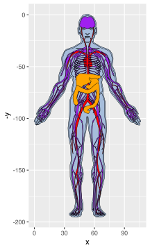
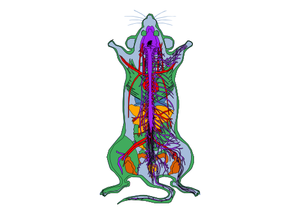

<!-- README.md is generated from README.Rmd. Please edit that file -->
gganatogram
-----------

[](https://ci.appveyor.com/project/jespermaag/gganatogram) [](https://travis-ci.com/jespermaag/gganatogram)

Create anatogram images for different organisms. <br/> For now only human male is available. <br/> This package uses the tissue coordinates from the figure in Expression Atlas. <https://www.ebi.ac.uk/gxa/home> <br/> <https://github.com/ebi-gene-expression-group/anatomogram> <br/>

If you use gganatogram please cite Expression Atlas as well. <br/> [Petryszak et al. 2015](https://academic.oup.com/nar/article/44/D1/D746/2502589) <br/> Petryszak, Robert, Maria Keays, Y. Amy Tang, Nuno A. Fonseca, Elisabet Barrera, Tony Burdett, Anja Füllgrabe et al. "Expression Atlas update—an integrated database of gene and protein expression in humans, animals and plants." Nucleic acids research 44, no. D1 (2015): D746-D752.

More plot examples can be found at <https://jespermaag.github.io/blog/2018/gganatogram/>

Install
-------

Install from github using devtools.

``` r
## install from Github
devtools::install_github("jespermaag/gganatogram")
```

Usage
-----

This package requires `ggplot2` and `ggpolypath` which loads when loading the package

``` r

library(gganatogram)
library(dplyr)
```

Available organisms

``` r
library(gridExtra)
hgMale <- gganatogram(data=hgMale_key, fillOutline='#a6bddb', organism='human', sex='male', fill="colour") + theme_void()
hgFemale <- gganatogram(data=hgFemale_key, fillOutline='#a6bddb', organism='human', sex='female', fill="colour") + theme_void()
mmMale <- gganatogram(data=mmMale_key, fillOutline='#a6bddb', organism='mouse', sex='male', fill="colour") + theme_void()

grid.arrange(hgMale, hgFemale, mmMale, ncol=3)
```


In order to use the function gganatogram, you need to have a data frame with organ, colour, and value if you want to.

``` r
organPlot <- data.frame(organ = c("heart", "leukocyte", "nerve", "brain", "liver", "stomach", "colon"), 
 type = c("circulation", "circulation",  "nervous system", "nervous system", "digestion", "digestion", "digestion"), 
 colour = c("red", "red", "purple", "purple", "orange", "orange", "orange"), 
 value = c(10, 5, 1, 8, 2, 5, 5), 
 stringsAsFactors=F)

 head(organPlot)
#>       organ           type colour value
#> 1     heart    circulation    red    10
#> 2 leukocyte    circulation    red     5
#> 3     nerve nervous system purple     1
#> 4     brain nervous system purple     8
#> 5     liver      digestion orange     2
#> 6   stomach      digestion orange     5
```

Using the function gganatogram with the filling the organs based on colour.

``` r
gganatogram(data=organPlot, fillOutline='#a6bddb', organism='human', sex='male', fill="colour")
```



Of course, we can use the ggplot themes and functions to adjust the plots

``` r
gganatogram(data=organPlot, fillOutline='#a6bddb', organism='human', sex='male', fill="colour") + 
theme_void()
```


We can also plot all tissues available using hgMale\_key

``` r
hgMale_key$organ
#>  [1] "bone_marrow"               "frontal_cortex"           
#>  [3] "prefrontal_cortex"         "aorta"                    
#>  [5] "gastroesophageal_junction" "left_ventricle"           
#>  [7] "caecum"                    "ileum"                    
#>  [9] "rectum"                    "nose"                     
#> [11] "tongue"                    "left_atrium"              
#> [13] "pulmonary_valve"           "mitral_valve"             
#> [15] "penis"                     "nasal_pharynx"            
#> [17] "spinal_cord"               "throat"                   
#> [19] "tricuspid_valve"           "diaphragm"                
#> [21] "liver"                     "stomach"                  
#> [23] "spleen"                    "duodenum"                 
#> [25] "gall_bladder"              "pancreas"                 
#> [27] "colon"                     "small_intestine"          
#> [29] "appendix"                  "smooth_muscle"            
#> [31] "urinary_bladder"           "bone"                     
#> [33] "cartilage"                 "esophagus"                
#> [35] "skin"                      "pleura"                   
#> [37] "brain"                     "heart"                    
#> [39] "lymph_node"                "adipose_tissue"           
#> [41] "skeletal_muscle"           "leukocyte"                
#> [43] "temporal_lobe"             "atrial_appendage"         
#> [45] "coronary_artery"           "hippocampus"              
#> [47] "vas_deferens"              "seminal_vesicle"          
#> [49] "epididymis"                "tonsil"                   
#> [51] "lung"                      "trachea"                  
#> [53] "bronchus"                  "nerve"                    
#> [55] "cerebellum"                "cerebellar_hemisphere"    
#> [57] "kidney"                    "renal_cortex"
gganatogram(data=hgMale_key, fillOutline='#a6bddb', organism='human', sex='male', fill="colour") +theme_void()
```


We can also skip plotting the outline of the graph

``` r
organPlot %>%
    dplyr::filter(type %in% c('circulation', 'nervous system')) %>%
gganatogram(outline=F, fillOutline='#a6bddb', organism='human', sex='male', fill="colour") + 
theme_void()
```


We can fill the tissues based on the values given to each organ

``` r
gganatogram(data=organPlot, fillOutline='#a6bddb', organism='human', sex='male', fill="value") + 
theme_void() +
scale_fill_gradient(low = "white", high = "red")
```


We can also use facet\_wrap to compare groups.
First create add two data frames together with different values and the conditions in the type column

``` r
compareGroups <- rbind(data.frame(organ = c("heart", "leukocyte", "nerve", "brain", "liver", "stomach", "colon"), 
  colour = c("red", "red", "purple", "purple", "orange", "orange", "orange"), 
 value = c(10, 5, 1, 8, 2, 5, 5), 
 type = rep('Normal', 7), 
 stringsAsFactors=F),
 data.frame(organ = c("heart", "leukocyte", "nerve", "brain", "liver", "stomach", "colon"), 
  colour = c("red", "red", "purple", "purple", "orange", "orange", "orange"), 
 value = c(5, 5, 10, 8, 2, 5, 5), 
 type = rep('Cancer', 7), 
 stringsAsFactors=F))
```

``` r
gganatogram(data=compareGroups, fillOutline='#a6bddb', organism='human', sex='male', fill="value") + 
theme_void() +
facet_wrap(~type) +
scale_fill_gradient(low = "white", high = "red") 
```


You can also split the tissues into types while retaining the outline

``` r
gganatogram(data=hgMale_key, outline = T, fillOutline='#a6bddb', organism='human', sex='male', fill="colour") +
facet_wrap(~type, ncol=4) +
theme_void()
```


Added female option
-------------------

All female tissues

``` r
hgFemale_key$organ
#>  [1] "pancreas"                  "liver"                    
#>  [3] "colon"                     "bone_marrow"              
#>  [5] "urinary_bladder"           "stomach"                  
#>  [7] "duodenum"                  "esophagus"                
#>  [9] "gall_bladder"              "spleen"                   
#> [11] "small_intestine"           "placenta"                 
#> [13] "endometrium"               "vagina"                   
#> [15] "aorta"                     "gastroesophageal_junction"
#> [17] "caecum"                    "appendix"                 
#> [19] "ileum"                     "left_atrium"              
#> [21] "left_ventricle"            "pulmonary_valve"          
#> [23] "mitral_valve"              "diaphragm"                
#> [25] "bone"                      "cartilage"                
#> [27] "throat"                    "rectum"                   
#> [29] "nasal_septum"              "nasal_pharynx"            
#> [31] "cerebellum"                "cerebellar_hemisphere"    
#> [33] "prefrontal_cortex"         "frontal_cortex"           
#> [35] "nose"                      "temporal_lobe"            
#> [37] "cerebral_cortex"           "kidney"                   
#> [39] "renal_cortex"              "coronary_artery"          
#> [41] "tricuspid_valve"           "skin"                     
#> [43] "adipose_tissue"            "heart"                    
#> [45] "smooth_muscle"             "brain"                    
#> [47] "lymph_node"                "skeletal_muscle"          
#> [49] "ovary"                     "leukocyte"                
#> [51] "fallopian_tube"            "uterus"                   
#> [53] "uterine_cervix"            "nerve"                    
#> [55] "atrial_appendage"          "ectocervix"               
#> [57] "hippocampus"               "pleura"                   
#> [59] "bronchus"                  "trachea"                  
#> [61] "lung"                      "tonsil"                   
#> [63] "spinal_cord"
gganatogram(data=hgFemale_key, outline = T, fillOutline='#a6bddb', organism='human', sex='female', fill="colour")  +theme_void()
```


You can also split the tissues into types while retaining the outline

``` r
gganatogram(data=hgFemale_key, outline = T, fillOutline='#a6bddb', organism='human', sex='female', fill="colour") +
facet_wrap(~type, ncol=4) +
theme_void()
```


To display the female repdoductive system with outline.

``` r
hgFemale_key %>%
    dplyr::filter(type=='reproductive') %>%
    gganatogram( outline = T, fillOutline='#a6bddb', organism='human', sex='female', fill="colour")  +
    theme_void()  +
    coord_cartesian(xlim = c(30, 75), ylim = c(-110, -80))
```


Added male mouse
================

``` r
mmMale_key$organ
#>  [1] "aorta"                     "brown_adipose_tissue"     
#>  [3] "stomach"                   "duodenum"                 
#>  [5] "pancreas"                  "spleen"                   
#>  [7] "adrenal_gland"             "kidney"                   
#>  [9] "colon"                     "small_intestine"          
#> [11] "caecum"                    "jejunum"                  
#> [13] "ileum"                     "esophagus"                
#> [15] "gall_bladder"              "lymph_node"               
#> [17] "seminal_vesicle"           "penis"                    
#> [19] "femur"                     "bone_marrow"              
#> [21] "cartilage"                 "quadriceps_femoris"       
#> [23] "spinal_cord"               "lung"                     
#> [25] "diaphragm"                 "trachea"                  
#> [27] "hindlimb"                  "trigeminal_nerve"         
#> [29] "sciatic_nerve"             "intestinal_mucosa"        
#> [31] "liver"                     "heart"                    
#> [33] "brain"                     "skeletal_muscle"          
#> [35] "circulatory_system"        "blood_vessel"             
#> [37] "skin"                      "prostate_gland"           
#> [39] "vas_deferens"              "epididymis"               
#> [41] "testis"                    "urinary_bladder"          
#> [43] "thymus"                    "peripheral_nervous_system"
#> [45] "eye"                       "LAYER_OUTLINE"            
#> [47] "outline"
gganatogram(data=mmMale_key, outline = T, fillOutline='#a6bddb', organism='mouse', sex='male', fill="colour")  +theme_void()  
```



``` r

gganatogram(data=mmMale_key, outline = T, fillOutline='#a6bddb', organism='mouse', sex='male', fill="colour")  +theme_void()+facet_wrap(~type, ncol=4)
```


