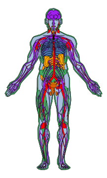
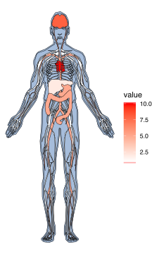

<!-- README.md is generated from README.Rmd. Please edit that file -->
gganatogram
-----------

[](https://ci.appveyor.com/project/jespermaag/gganatogram) [](https://travis-ci.com/jespermaag/gganatogram)

Create anatogram images for different organisms. <br/> For now only human male is available. <br/> This package uses the tissue coordinates from the figure in Expression Atlas. <br/> <https://www.ebi.ac.uk/gxa/home> <br/> <https://github.com/ebi-gene-expression-group/anatomogram> <br/>

More plot examples can be found at <https://jespermaag.github.io/blog/2018/gganatogram/>

Install
-------

Install from github using devtools.

``` r
## install from Github
devtools::install_github("jespermaag/gganatogram")
```

Usage
-----

This package requires `ggplot2` and `ggpolypath`

``` r

library(gganatogram)
#> Loading required package: ggpolypath
#> Loading required package: ggplot2
#> Warning: package 'ggplot2' was built under R version 3.4.4
library(dplyr)
#> Warning: package 'dplyr' was built under R version 3.4.4
#> 
#> Attaching package: 'dplyr'
#> The following objects are masked from 'package:stats':
#> 
#>     filter, lag
#> The following objects are masked from 'package:base':
#> 
#>     intersect, setdiff, setequal, union
```

In order to use the function gganatogram, you need to have a data frame with organ, colour, and value if you want to.

``` r
organPlot <- data.frame(organ = c("heart", "leukocyte", "nerve", "brain", "liver", "stomach", "colon"), 
 type = c("circulation", "circulation",  "nervous system", "nervous system", "digestion", "digestion", "digestion"), 
 colour = c("red", "red", "purple", "purple", "orange", "orange", "orange"), 
 value = c(10, 5, 1, 8, 2, 5, 5), 
 stringsAsFactors=F)

 head(organPlot)
#>       organ           type colour value
#> 1     heart    circulation    red    10
#> 2 leukocyte    circulation    red     5
#> 3     nerve nervous system purple     1
#> 4     brain nervous system purple     8
#> 5     liver      digestion orange     2
#> 6   stomach      digestion orange     5
```

Using the function gganatogram with the filling the organs based on colour.

``` r
gganatogram(data=organPlot, fillOutline='#a6bddb', organism='human', sex='male', fill="colour")
```


Of course, we can use the ggplot themes and functions to adjust the plots

``` r
gganatogram(data=organPlot, fillOutline='#a6bddb', organism='human', sex='male', fill="colour") + 
theme_void()
```


We can also plot all tissues available using hgMale\_key

``` r
hgMale_key$organ
#>  [1] "bone_marrow"               "frontal_cortex"           
#>  [3] "prefrontal_cortex"         "aorta"                    
#>  [5] "gastroesophageal_junction" "left_ventricle"           
#>  [7] "caecum"                    "ileum"                    
#>  [9] "rectum"                    "nose"                     
#> [11] "tongue"                    "left_atrium"              
#> [13] "pulmonary_valve"           "mitral_valve"             
#> [15] "penis"                     "nasal_pharynx"            
#> [17] "spinal_cord"               "throat"                   
#> [19] "tricuspid_valve"           "diaphragm"                
#> [21] "liver"                     "stomach"                  
#> [23] "spleen"                    "duodenum"                 
#> [25] "gall_bladder"              "pancreas"                 
#> [27] "colon"                     "small_intestine"          
#> [29] "appendix"                  "smooth_muscle"            
#> [31] "urinary_bladder"           "bone"                     
#> [33] "cartilage"                 "esophagus"                
#> [35] "skin"                      "pleura"                   
#> [37] "brain"                     "heart"                    
#> [39] "lymph_node"                "adipose_tissue"           
#> [41] "skeletal_muscle"           "leukocyte"                
#> [43] "temporal_lobe"             "atrial_appendage"         
#> [45] "coronary_artery"           "hippocampus"              
#> [47] "vas_deferens"              "seminal_vesicle"          
#> [49] "epididymis"                "tonsil"                   
#> [51] "lung"                      "trachea"                  
#> [53] "bronchus"                  "nerve"                    
#> [55] "cerebellum"                "cerebellar_hemisphere"    
#> [57] "kidney"                    "renal_cortex"
gganatogram(data=hgMale_key, fillOutline='#a6bddb', organism='human', sex='male', fill="colour") +theme_void()
```



We can also skip plotting the outline of the graph

``` r
organPlot %>%
    dplyr::filter(type %in% c('circulation', 'nervous system')) %>%
gganatogram(outline=F, fillOutline='#a6bddb', organism='human', sex='male', fill="colour") + 
theme_void()
#> Warning: package 'bindrcpp' was built under R version 3.4.4
```


We can fill the tissues based on the values given to each organ

``` r
gganatogram(data=organPlot, fillOutline='#a6bddb', organism='human', sex='male', fill="value") + 
theme_void() +
scale_fill_gradient(low = "white", high = "red")
```



We can also use facet\_wrap to compare groups.
First create add two data frames together with different values and the conditions in the type column

``` r
compareGroups <- rbind(data.frame(organ = c("heart", "leukocyte", "nerve", "brain", "liver", "stomach", "colon"), 
  colour = c("red", "red", "purple", "purple", "orange", "orange", "orange"), 
 value = c(10, 5, 1, 8, 2, 5, 5), 
 type = rep('Normal', 7), 
 stringsAsFactors=F),
 data.frame(organ = c("heart", "leukocyte", "nerve", "brain", "liver", "stomach", "colon"), 
  colour = c("red", "red", "purple", "purple", "orange", "orange", "orange"), 
 value = c(5, 5, 10, 8, 2, 5, 5), 
 type = rep('Cancer', 7), 
 stringsAsFactors=F))
```

``` r
gganatogram(data=compareGroups, fillOutline='#a6bddb', organism='human', sex='male', fill="value") + 
theme_void() +
facet_wrap(~type) +
scale_fill_gradient(low = "white", high = "red") 
```


You can also split the tissues into types while retaining the outline

``` r
gganatogram(data=hgMale_key, outline = T, fillOutline='#a6bddb', organism='human', sex='male', fill="colour") +
facet_wrap(~type, ncol=4) +
theme_classic()
```


